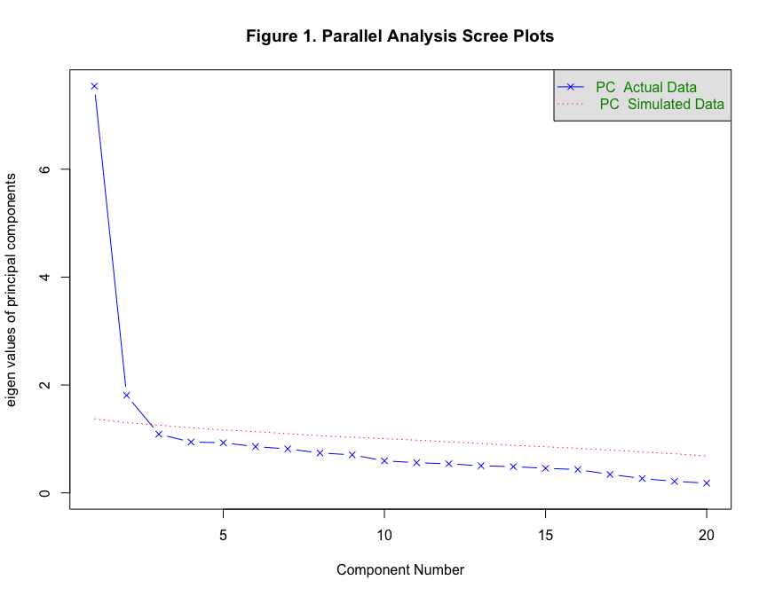
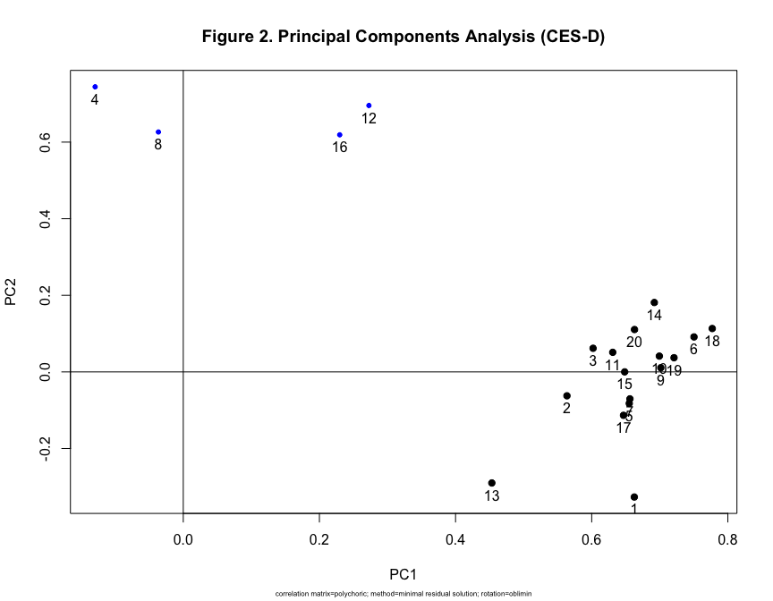
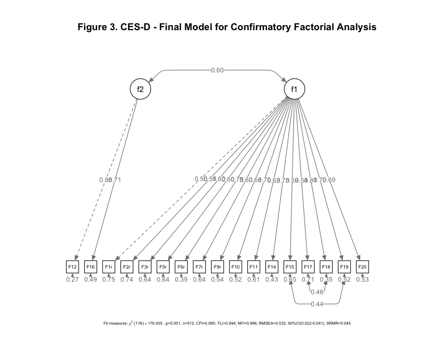
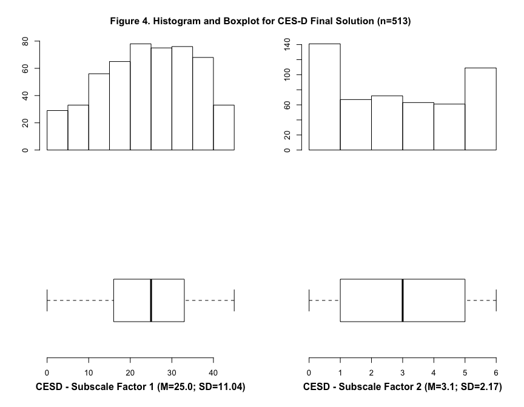

# CES-D
Ana Luísa Marlière Casela; Leonardo Fernandes Martins; Pollyanna Santos da Silveira; Kimber Richter; Telmo Mota Ronzani  
03 de fevereiro de 2016  

This is a public document with all scripts used to review the manuscript: 

"Psychometric properties of the Center for Epidemiologic Studies Depression Scale (CES-D) among people in treatment for substance use disorders"

All files used here are availible in a public repository accessible by the following url:

https://github.com/crepeia/CES-D_SubstanceAbuse


#Abstract
ABSTRACT
Objective: Depression is an important and prevalent comorbidity for substance addiction affecting the patient’s quality of life and decreasing adherence to substance abuse treatment. Measuring depressive symptoms is considered a crucial step for treatment. Among the instruments developed that measure the level of self-reported depression symptoms, the Center for Epidemiologic Studies Depression Scale (CES-D) has been widely used in clinical and populational studies. The present study aimed to evaluate psychometric properties of CES-D for a clinical sample of persons with drug addiction diagnostic. Method: 513 outpatients from two public health services for substance abuse treatment participated of this study. We evaluated construct validity in our sample using principal components analysis (PCA) and a confirmatory factorial analysis (CFA) to compare different models. Divergent and convergent validity was evaluated using Pearson correlation test. Reliability coefficients were calculated  by Cronbach’s alpha (α) and average split-half test. Results: PCA indicated a two dimensional structure explaining 47% of total variance. Based on these components we proposed a two factor structure that had a good fit for our sample  (χ2(116)=176.935, p<0.001; CFI=0.995; TLI=0.994; RMSEA=0.032,). The first factor (F1) composed by negative affects and depression symptoms items had high internal consistency (α=0.88) and a second one (F2) measuring absence of positive affect had low/moderated internal consistency (α=0.67). Convergent validity was supported by moderate positive correlation between CES-D factors and Self-Stigma (F1, r=0.45, p<0.001; F2, r=0.23, p<0,001). Divergent validity was supported by negative moderated correlation with Hope (F1, r = -0.33, p< 0.001; F2, r= -0.39; p<0.001) and Self-Esteem (F1, r = 0.45, p< 0.001; F2, r= 0.24, p<0.001). Our model showed a slightly better performance compared to other structures proposed by previous Brazilian studies. Conclusion: The psychometric properties of our proposed model, considering validity and reliability measures supports the use of CES-D to evaluate depression symptoms among people in treatment for substance use disorders. Keywords: Depression; Psychometrics; Validation Studies and Substance-Related Disorders.


#Preparing new analysis to CES-D manuscript review

Loading required packages

```r
require(foreign) # Read data stored SPSS
```

```
## Loading required package: foreign
```

```r
require(car) #Recode Variables
```

```
## Loading required package: car
```

```r
require(psych) #Psychometrics
```

```
## Loading required package: psych
## 
## Attaching package: 'psych'
## 
## The following object is masked from 'package:car':
## 
##     logit
```

```r
require(lavaan) #Confirmatory and SEM
```

```
## Loading required package: lavaan
## This is lavaan 0.5-18
## lavaan is BETA software! Please report any bugs.
```

```r
require(semPlot) # Plots for SEM
```

```
## Loading required package: semPlot
```

```r
require(semTools) # Comparing SEM models
```

```
## Loading required package: semTools
##  
## ###############################################################################
## This is semTools 0.4-9
## All users of R (or SEM) are invited to submit functions or ideas for functions.
## ###############################################################################
## 
## Attaching package: 'semTools'
## 
## The following object is masked from 'package:psych':
## 
##     skew
```


```r
#Setting Directory
setwd("~/CES-D_SubstanceAbuse")

#Importing SPSS file .sav
base.dat <- read.spss("PD10.sav", to.data.frame = T)
```

```
## Warning in read.spss("PD10.sav", to.data.frame = T): PD10.sav: Unrecognized
## record type 7, subtype 18 encountered in system file
```

```
## re-encoding from latin1
```

```r
#Sum CESD itens in order to find NA
base.dat$scaleSum <- rowSums(base.dat[,267:286])

#Recoding reversed itens
base.dat$F4r<- recode(base.dat$F4r, "0=3; 1=2; 2=1; 3=0")
base.dat$F8r<- recode(base.dat$F8r, "0=3; 1=2; 2=1; 3=0")
base.dat$F12r<- recode(base.dat$F12r, "0=3; 1=2; 2=1; 3=0")
base.dat$F16r<- recode(base.dat$F16r, "0=3; 1=2; 2=1; 3=0")

#Creating a subset for analysis without NA
base.CESD <- subset(base.dat, subset=!is.na(base.dat$scaleSum))

#Creating a subset only with CESD
fullScale  <- base.CESD[ , 267:286]

#Creating a polychoric correlation
fullScaleT<-polychoric(fullScale)

#Cloning fullScale
fullScale2 <- fullScale

#Creating a categorical ordered subset for CFA analisys
orderedScale <-fullScale2[,c("F1r",
        "F2r",
        "F3r",
        "F4r",
        "F5r",
        "F6r",
        "F7r",
        "F8r",
        "F9r",
        "F10r",
        "F11r",
        "F12r",
        "F13r",
        "F14r",
        "F15r",
        "F16r",
        "F17r",
        "F18r",
        "F19r",
        "F20r")] <-
lapply(fullScale2[,c("F1r",
        "F2r",
        "F3r",
        "F4r",
        "F5r",
        "F6r",
        "F7r",
        "F8r",
        "F9r",
        "F10r",
        "F11r",
        "F12r",
        "F13r",
        "F14r",
        "F15r",
        "F16r",
        "F17r",
        "F18r",
        "F19r",
        "F20r")], ordered)
orderedScale<-as.data.frame(orderedScale)
```


```r
# Bartlett Test
cortest.bartlett(fullScaleT$rho, n=nrow(fullScale))
```

```
## $chisq
## [1] 4462.717
## 
## $p.value
## [1] 0
## 
## $df
## [1] 190
```


```r
# KMO
KMO(fullScaleT$rho)
```

```
## Kaiser-Meyer-Olkin factor adequacy
## Call: KMO(r = fullScaleT$rho)
## Overall MSA =  0.9
## MSA for each item = 
##  F1r  F2r  F3r  F4r  F5r  F6r  F7r  F8r  F9r F10r F11r F12r F13r F14r F15r 
## 0.92 0.89 0.93 0.75 0.92 0.92 0.95 0.79 0.95 0.91 0.91 0.83 0.88 0.94 0.84 
## F16r F17r F18r F19r F20r 
## 0.84 0.85 0.89 0.87 0.93
```


```r
# Setting a randon number generator
set.seed(234) 
# Parallel Analysis
fa.parallel(fullScaleT$rho, fm="minres", fa="pc", n.obs=513, main = "Figure 1. Parallel Analysis Scree Plots")
```

 

```
## Parallel analysis suggests that the number of factors =  NA  and the number of components =  2
```

#Principal Components Analysis

```r
#PCA - 2 components oblique rotated (assuming the components are correlated)
PCA2 <- principal(fullScaleT$rho, nfactors = 2, rotate="oblimin", method = "minres")
```

```
## Loading required namespace: GPArotation
```

```r
print.psych(PCA2, digits=2, cut= .4)
```

```
## Principal Components Analysis
## Call: principal(r = fullScaleT$rho, nfactors = 2, rotate = "oblimin", 
##     method = "minres")
## Standardized loadings (pattern matrix) based upon correlation matrix
##        PC1   PC2   h2   u2 com
## F1r   0.66       0.41 0.59 1.5
## F2r   0.56       0.30 0.70 1.0
## F3r   0.60       0.39 0.61 1.0
## F4r         0.74 0.51 0.49 1.1
## F5r   0.66       0.40 0.60 1.0
## F6r   0.75       0.61 0.39 1.0
## F7r   0.66       0.41 0.59 1.0
## F8r         0.63 0.38 0.62 1.0
## F9r   0.70       0.50 0.50 1.0
## F10r  0.70       0.51 0.49 1.0
## F11r  0.63       0.42 0.58 1.0
## F12r        0.70 0.67 0.33 1.3
## F13r  0.45       0.21 0.79 1.7
## F14r  0.69       0.59 0.41 1.1
## F15r  0.65       0.42 0.58 1.0
## F16r        0.62 0.52 0.48 1.3
## F17r  0.65       0.39 0.61 1.1
## F18r  0.78       0.67 0.33 1.0
## F19r  0.72       0.54 0.46 1.0
## F20r  0.66       0.50 0.50 1.1
## 
##                        PC1  PC2
## SS loadings           7.20 2.15
## Proportion Var        0.36 0.11
## Cumulative Var        0.36 0.47
## Proportion Explained  0.77 0.23
## Cumulative Proportion 0.77 1.00
## 
##  With component correlations of 
##      PC1  PC2
## PC1 1.00 0.31
## PC2 0.31 1.00
## 
## Mean item complexity =  1.1
## Test of the hypothesis that 2 components are sufficient.
## 
## The root mean square of the residuals (RMSR) is  0.06 
## 
## Fit based upon off diagonal values = 0.97
```

```r
plot.psych(PCA2, title="Figure 2. Principal Components Analysis (CES-D)", title(sub = "correlation matrix=polychoric; method=minimal residual solution; rotation=oblimin", font.sub = 1, cex.sub = 0.5))
```

 

```r
#Component 1
C1_PCA2 <- fullScale[, c("F1r","F2r","F3r","F5r","F6r","F7r","F9r","F10r","F11r","F13r","F14r","F15r","F17r","F18r","F19r","F20r")]
alpha(C1_PCA2, check.keys = TRUE)
```

```
## 
## Reliability analysis   
## Call: alpha(x = C1_PCA2, check.keys = TRUE)
## 
##   raw_alpha std.alpha G6(smc) average_r S/N   ase mean   sd
##       0.88      0.88    0.88      0.31 7.3 0.012  1.6 0.71
## 
##  lower alpha upper     95% confidence boundaries
## 0.86 0.88 0.9 
## 
##  Reliability if an item is dropped:
##      raw_alpha std.alpha G6(smc) average_r S/N alpha se
## F1r       0.88      0.88    0.88      0.32 7.1    0.012
## F2r       0.88      0.88    0.88      0.32 7.1    0.012
## F3r       0.87      0.87    0.88      0.32 6.9    0.012
## F5r       0.87      0.87    0.88      0.32 6.9    0.012
## F6r       0.87      0.87    0.87      0.31 6.6    0.013
## F7r       0.87      0.87    0.88      0.32 6.9    0.012
## F9r       0.87      0.87    0.88      0.31 6.8    0.013
## F10r      0.87      0.87    0.87      0.31 6.7    0.013
## F11r      0.87      0.87    0.88      0.32 6.9    0.012
## F13r      0.88      0.88    0.89      0.34 7.6    0.012
## F14r      0.87      0.87    0.87      0.31 6.7    0.013
## F15r      0.87      0.87    0.88      0.31 6.9    0.012
## F17r      0.88      0.88    0.88      0.32 7.0    0.012
## F18r      0.87      0.87    0.87      0.30 6.5    0.013
## F19r      0.87      0.87    0.87      0.31 6.7    0.013
## F20r      0.87      0.87    0.88      0.31 6.8    0.013
## 
##  Item statistics 
##        n raw.r std.r r.cor r.drop mean  sd
## F1r  513  0.52  0.53  0.47   0.44  1.5 1.1
## F2r  513  0.52  0.52  0.47   0.44  1.4 1.2
## F3r  513  0.58  0.58  0.54   0.50  1.7 1.2
## F5r  513  0.58  0.58  0.54   0.51  1.5 1.2
## F6r  513  0.69  0.69  0.68   0.63  2.0 1.1
## F7r  513  0.58  0.58  0.54   0.51  1.7 1.2
## F9r  513  0.64  0.64  0.61   0.57  1.8 1.2
## F10r 513  0.65  0.65  0.62   0.58  1.5 1.2
## F11r 513  0.59  0.59  0.55   0.51  1.9 1.2
## F13r 513  0.36  0.36  0.29   0.27  1.4 1.2
## F14r 513  0.67  0.67  0.65   0.60  1.8 1.2
## F15r 513  0.60  0.60  0.57   0.52  1.3 1.2
## F17r 513  0.56  0.55  0.51   0.48  1.2 1.2
## F18r 513  0.72  0.73  0.72   0.67  2.0 1.1
## F19r 513  0.67  0.66  0.64   0.60  1.4 1.3
## F20r 513  0.63  0.63  0.59   0.56  1.7 1.2
## 
## Non missing response frequency for each item
##         0    1    2    3 miss
## F1r  0.27 0.26 0.22 0.26    0
## F2r  0.34 0.21 0.21 0.24    0
## F3r  0.21 0.22 0.19 0.38    0
## F5r  0.27 0.23 0.21 0.29    0
## F6r  0.15 0.16 0.20 0.50    0
## F7r  0.25 0.17 0.21 0.37    0
## F9r  0.24 0.18 0.15 0.43    0
## F10r 0.30 0.19 0.18 0.32    0
## F11r 0.19 0.15 0.18 0.47    0
## F13r 0.30 0.25 0.17 0.28    0
## F14r 0.23 0.16 0.16 0.45    0
## F15r 0.36 0.22 0.16 0.26    0
## F17r 0.41 0.19 0.14 0.26    0
## F18r 0.15 0.17 0.17 0.51    0
## F19r 0.36 0.18 0.15 0.31    0
## F20r 0.24 0.18 0.16 0.41    0
```

```r
splitHalf(C1_PCA2)
```

```
## Split half reliabilities  
## Call: splitHalf(r = C1_PCA2)
## 
## Maximum split half reliability (lambda 4) =  0.92
## Guttman lambda 6                          =  0.88
## Average split half reliability            =  0.88
## Guttman lambda 3 (alpha)                  =  0.88
## Minimum split half reliability  (beta)    =  0.83
```

```r
#Component 2
C2_PCA2 <- fullScale[, c("F4r","F8r","F12r","F16r")]
alpha(C2_PCA2, check.keys = TRUE)
```

```
## 
## Reliability analysis   
## Call: alpha(x = C2_PCA2, check.keys = TRUE)
## 
##   raw_alpha std.alpha G6(smc) average_r S/N   ase mean   sd
##       0.62      0.61    0.57      0.28 1.6 0.043  1.4 0.82
## 
##  lower alpha upper     95% confidence boundaries
## 0.53 0.62 0.7 
## 
##  Reliability if an item is dropped:
##      raw_alpha std.alpha G6(smc) average_r  S/N alpha se
## F4r       0.59      0.58    0.51      0.32 1.39    0.052
## F8r       0.61      0.60    0.53      0.34 1.53    0.051
## F12r      0.45      0.45    0.35      0.21 0.82    0.060
## F16r      0.52      0.52    0.42      0.27 1.09    0.056
## 
##  Item statistics 
##        n raw.r std.r r.cor r.drop mean  sd
## F4r  513  0.63  0.64  0.43   0.34  1.4 1.2
## F8r  513  0.61  0.62  0.39   0.31  1.1 1.2
## F12r 513  0.76  0.76  0.67   0.52  1.6 1.2
## F16r 513  0.72  0.70  0.57   0.42  1.5 1.3
## 
## Non missing response frequency for each item
##         0    1    2    3 miss
## F4r  0.33 0.21 0.21 0.24    0
## F8r  0.44 0.18 0.19 0.18    0
## F12r 0.27 0.17 0.21 0.34    0
## F16r 0.36 0.12 0.18 0.34    0
```

```r
splitHalf(C2_PCA2)
```

```
## Split half reliabilities  
## Call: splitHalf(r = C2_PCA2)
## 
## Maximum split half reliability (lambda 4) =  0.66
## Guttman lambda 6                          =  0.57
## Average split half reliability            =  0.44
## Guttman lambda 3 (alpha)                  =  0.61
## Minimum split half reliability  (beta)    =  0.51
```

#Confirmatory Models


```r
#Batistoni CFA Model

#Model Identification
Batistoni <- '
              # latent variable definitions 
               f1 =~ F18r + F14r + F6r + F13r + F19r + F17r + F9r + F10r + F20r
               f2 =~ F3r + F1r + F7r + F5r + F2r
               f3 =~F12r + F8r + F16r + F4r

              # variances and covariances 
               f1 ~~ f2 
               f2 ~~ f3 
               f1 ~~ f3
                        '
#CFA Fit
fitBatistoni <- cfa(Batistoni, estimator="WLSMVS", mimic = "Mplus", data = orderedScale,
           ordered=c("F1r",
        "F2r",
        "F3r",
        "F4r",
        "F5r",
        "F6r",
        "F7r",
        "F8r",
        "F9r",
        "F10r",
        "F11r",
        "F12r",
        "F13r",
        "F14r",
        "F15r",
        "F16r",
        "F17r",
        "F18r",
        "F19r",
        "F20r"))
```

```
## Found more than one class "Model" in cache; using the first, from namespace 'MatrixModels'
```

```r
#Model Summary 
summary(fitBatistoni, standardized=T, fit.measures=T, rsquare=T)
```

```
## lavaan (0.5-18) converged normally after  32 iterations
## 
##   Number of observations                           513
## 
##   Estimator                                       DWLS      Robust
##   Minimum Function Test Statistic              224.932     228.354
##   Degrees of freedom                               132          81
##   P-value (Chi-square)                           0.000       0.000
##   Scaling correction factor                                  0.985
##     for the mean and variance adjusted correction (WLSMV)
## 
## Model test baseline model:
## 
##   Minimum Function Test Statistic            10633.966    2367.719
##   Degrees of freedom                               153          34
##   P-value                                        0.000       0.000
## 
## User model versus baseline model:
## 
##   Comparative Fit Index (CFI)                    0.991       0.937
##   Tucker-Lewis Index (TLI)                       0.990       0.973
## 
## Root Mean Square Error of Approximation:
## 
##   RMSEA                                          0.037       0.060
##   90 Percent Confidence Interval          0.029  0.045       0.050  0.069
##   P-value RMSEA <= 0.05                          0.996       0.042
## 
## Weighted Root Mean Square Residual:
## 
##   WRMR                                           1.042       1.042
## 
## Parameter estimates:
## 
##   Information                                 Expected
##   Standard Errors                           Robust.sem
## 
##                    Estimate  Std.err  Z-value  P(>|z|)   Std.lv  Std.all
## Latent variables:
##   f1 =~
##     F18r              1.000                               0.840    0.840
##     F14r              0.902    0.037   24.670    0.000    0.757    0.757
##     F6r               0.935    0.036   25.951    0.000    0.785    0.785
##     F13r              0.356    0.053    6.699    0.000    0.299    0.299
##     F19r              0.839    0.038   22.110    0.000    0.704    0.704
##     F17r              0.704    0.041   17.136    0.000    0.591    0.591
##     F9r               0.818    0.040   20.635    0.000    0.687    0.687
##     F10r              0.817    0.040   20.352    0.000    0.686    0.686
##     F20r              0.823    0.041   19.972    0.000    0.691    0.691
##   f2 =~
##     F3r               1.000                               0.654    0.654
##     F1r               0.839    0.075   11.225    0.000    0.549    0.549
##     F7r               0.995    0.077   12.893    0.000    0.650    0.650
##     F5r               0.996    0.076   13.073    0.000    0.651    0.651
##     F2r               0.823    0.068   12.068    0.000    0.538    0.538
##   f3 =~
##     F12r              1.000                               0.897    0.897
##     F8r               0.406    0.067    6.086    0.000    0.364    0.364
##     F16r              0.810    0.068   11.844    0.000    0.726    0.726
##     F4r               0.368    0.067    5.503    0.000    0.330    0.330
## 
## Covariances:
##   f1 ~~
##     f2                0.474    0.033   14.239    0.000    0.864    0.864
##   f2 ~~
##     f3                0.248    0.035    7.049    0.000    0.424    0.424
##   f1 ~~
##     f3                0.435    0.036   12.081    0.000    0.578    0.578
## 
## Intercepts:
##     F18r              0.000                               0.000    0.000
##     F14r              0.000                               0.000    0.000
##     F6r               0.000                               0.000    0.000
##     F13r              0.000                               0.000    0.000
##     F19r              0.000                               0.000    0.000
##     F17r              0.000                               0.000    0.000
##     F9r               0.000                               0.000    0.000
##     F10r              0.000                               0.000    0.000
##     F20r              0.000                               0.000    0.000
##     F3r               0.000                               0.000    0.000
##     F1r               0.000                               0.000    0.000
##     F7r               0.000                               0.000    0.000
##     F5r               0.000                               0.000    0.000
##     F2r               0.000                               0.000    0.000
##     F12r              0.000                               0.000    0.000
##     F8r               0.000                               0.000    0.000
##     F16r              0.000                               0.000    0.000
##     F4r               0.000                               0.000    0.000
##     f1                0.000                               0.000    0.000
##     f2                0.000                               0.000    0.000
##     f3                0.000                               0.000    0.000
## 
## Thresholds:
##     F18r|t1          -1.019    0.067  -15.163    0.000   -1.019   -1.019
##     F18r|t2          -0.452    0.057   -7.866    0.000   -0.452   -0.452
##     F18r|t3          -0.017    0.055   -0.309    0.758   -0.017   -0.017
##     F14r|t1          -0.752    0.061  -12.229    0.000   -0.752   -0.752
##     F14r|t2          -0.290    0.056   -5.154    0.000   -0.290   -0.290
##     F14r|t3           0.115    0.056    2.073    0.038    0.115    0.115
##     F6r|t1           -1.028    0.067  -15.237    0.000   -1.028   -1.028
##     F6r|t2           -0.502    0.058   -8.648    0.000   -0.502   -0.502
##     F6r|t3            0.012    0.055    0.221    0.825    0.012    0.012
##     F13r|t1          -0.529    0.058   -9.081    0.000   -0.529   -0.529
##     F13r|t2           0.115    0.056    2.073    0.038    0.115    0.115
##     F13r|t3           0.575    0.059    9.771    0.000    0.575    0.575
##     F19r|t1          -0.346    0.057   -6.119    0.000   -0.346   -0.346
##     F19r|t2           0.100    0.055    1.808    0.071    0.100    0.100
##     F19r|t3           0.490    0.058    8.474    0.000    0.490    0.490
##     F17r|t1          -0.224    0.056   -4.011    0.000   -0.224   -0.224
##     F17r|t2           0.264    0.056    4.714    0.000    0.264    0.264
##     F17r|t3           0.658    0.060   10.967    0.000    0.658    0.658
##     F9r|t1           -0.707    0.061  -11.643    0.000   -0.707   -0.707
##     F9r|t2           -0.204    0.056   -3.659    0.000   -0.204   -0.204
##     F9r|t3            0.179    0.056    3.218    0.001    0.179    0.179
##     F10r|t1          -0.518    0.058   -8.908    0.000   -0.518   -0.518
##     F10r|t2          -0.007    0.055   -0.132    0.895   -0.007   -0.007
##     F10r|t3           0.469    0.058    8.127    0.000    0.469    0.469
##     F20r|t1          -0.695    0.061  -11.475    0.000   -0.695   -0.695
##     F20r|t2          -0.189    0.056   -3.394    0.001   -0.189   -0.189
##     F20r|t3           0.224    0.056    4.011    0.000    0.224    0.224
##     F3r|t1           -0.818    0.063  -13.053    0.000   -0.818   -0.818
##     F3r|t2           -0.184    0.056   -3.306    0.001   -0.184   -0.184
##     F3r|t3            0.310    0.056    5.505    0.000    0.310    0.310
##     F1r|t1           -0.616    0.059  -10.371    0.000   -0.616   -0.616
##     F1r|t2            0.071    0.055    1.279    0.201    0.071    0.071
##     F1r|t3            0.658    0.060   10.967    0.000    0.658    0.658
##     F7r|t1           -0.676    0.060  -11.222    0.000   -0.676   -0.676
##     F7r|t2           -0.199    0.056   -3.571    0.000   -0.199   -0.199
##     F7r|t3            0.326    0.056    5.768    0.000    0.326    0.326
##     F5r|t1           -0.622    0.059  -10.456    0.000   -0.622   -0.622
##     F5r|t2            0.002    0.055    0.044    0.965    0.002    0.002
##     F5r|t3            0.546    0.059    9.340    0.000    0.546    0.546
##     F2r|t1           -0.409    0.057   -7.168    0.000   -0.409   -0.409
##     F2r|t2            0.120    0.056    2.161    0.031    0.120    0.120
##     F2r|t3            0.707    0.061   11.643    0.000    0.707    0.707
##     F12r|t1          -0.604    0.059  -10.200    0.000   -0.604   -0.604
##     F12r|t2          -0.145    0.056   -2.602    0.009   -0.145   -0.145
##     F12r|t3           0.404    0.057    7.081    0.000    0.404    0.404
##     F8r|t1           -0.140    0.056   -2.513    0.012   -0.140   -0.140
##     F8r|t2            0.321    0.056    5.680    0.000    0.321    0.321
##     F8r|t3            0.918    0.065   14.173    0.000    0.918    0.918
##     F16r|t1          -0.362    0.057   -6.381    0.000   -0.362   -0.362
##     F16r|t2          -0.046    0.055   -0.838    0.402   -0.046   -0.046
##     F16r|t3           0.415    0.057    7.256    0.000    0.415    0.415
##     F4r|t1           -0.431    0.057   -7.517    0.000   -0.431   -0.431
##     F4r|t2            0.110    0.056    1.984    0.047    0.110    0.110
##     F4r|t3            0.701    0.061   11.559    0.000    0.701    0.701
## 
## Variances:
##     F18r              0.295                               0.295    0.295
##     F14r              0.426                               0.426    0.426
##     F6r               0.384                               0.384    0.384
##     F13r              0.911                               0.911    0.911
##     F19r              0.504                               0.504    0.504
##     F17r              0.651                               0.651    0.651
##     F9r               0.528                               0.528    0.528
##     F10r              0.530                               0.530    0.530
##     F20r              0.523                               0.523    0.523
##     F3r               0.573                               0.573    0.573
##     F1r               0.699                               0.699    0.699
##     F7r               0.577                               0.577    0.577
##     F5r               0.576                               0.576    0.576
##     F2r               0.710                               0.710    0.710
##     F12r              0.196                               0.196    0.196
##     F8r               0.867                               0.867    0.867
##     F16r              0.473                               0.473    0.473
##     F4r               0.891                               0.891    0.891
##     f1                0.705    0.039   18.064    0.000    1.000    1.000
##     f2                0.427    0.048    8.928    0.000    1.000    1.000
##     f3                0.804    0.072   11.120    0.000    1.000    1.000
## 
## R-Square:
## 
##     F18r              0.705
##     F14r              0.574
##     F6r               0.616
##     F13r              0.089
##     F19r              0.496
##     F17r              0.349
##     F9r               0.472
##     F10r              0.470
##     F20r              0.477
##     F3r               0.427
##     F1r               0.301
##     F7r               0.423
##     F5r               0.424
##     F2r               0.290
##     F12r              0.804
##     F8r               0.133
##     F16r              0.527
##     F4r               0.109
```

```r
#Model Fit Measures
fitMeasures(fitBatistoni, c("chisq","df","rmsea","rmsea.ci.lower", "rmsea.ci.upper", "srmr", "cfi", "tli", "nfi", "ecvi"))
```

```
##          chisq             df          rmsea rmsea.ci.lower rmsea.ci.upper 
##        224.932        132.000          0.037          0.029          0.045 
##           srmr            cfi            tli            nfi           ecvi 
##          0.050          0.991          0.990          0.979             NA
```

```r
#Modification Index
MIBatistoni<-modindices(fitBatistoni)
MIIBatistoni<- MIBatistoni[which(MIBatistoni$mi>30),]
print(MIIBatistoni)
```

```
##    lhs op  rhs     mi mi.scaled   epc sepc.lv sepc.all sepc.nox
## 1 F18r ~~ F17r 31.979    32.465 0.232   0.232    0.232    0.232
```


```r
#Silveira CFA Model

#Model Identification
Silveira <- '
              # latent variable definitions 
               f1 =~ F18r + F14r + F6r + F3r + F13r
               f2 =~ F19r + F15r + F17r + F1r + F9r + F10r
               f3 =~ F20r + F7r + F5r + F11r
               f4 =~ F12r + F8r + F16r

             # variances and covariances 
               f1 ~~ f2 
               f2 ~~ f3 
               f3 ~~ f4
               f1 ~~ f4
               f1 ~~ f3 
                       '

#Model Fit
fitSilveira <- cfa(Silveira, estimator="WLSMVS", mimic = "Mplus", data = orderedScale,
        ordered=c("F1r",
        "F2r",
        "F3r",
        "F4r",
        "F5r",
        "F6r",
        "F7r",
        "F8r",
        "F9r",
        "F10r",
        "F11r",
        "F12r",
        "F13r",
        "F14r",
        "F15r",
        "F16r",
        "F17r",
        "F18r",
        "F19r",
        "F20r"))

#Model Summary 
summary(fitSilveira, standardized=T, fit.measures=T, rsquare=T)
```

```
## lavaan (0.5-18) converged normally after  35 iterations
## 
##   Number of observations                           513
## 
##   Estimator                                       DWLS      Robust
##   Minimum Function Test Statistic              218.990     236.903
##   Degrees of freedom                               129          81
##   P-value (Chi-square)                           0.000       0.000
##   Scaling correction factor                                  0.924
##     for the mean and variance adjusted correction (WLSMV)
## 
## Model test baseline model:
## 
##   Minimum Function Test Statistic            12355.368    2508.265
##   Degrees of freedom                               153          31
##   P-value                                        0.000       0.000
## 
## User model versus baseline model:
## 
##   Comparative Fit Index (CFI)                    0.993       0.937
##   Tucker-Lewis Index (TLI)                       0.991       0.976
## 
## Root Mean Square Error of Approximation:
## 
##   RMSEA                                          0.037       0.061
##   90 Percent Confidence Interval          0.028  0.045       0.052  0.071
##   P-value RMSEA <= 0.05                          0.996       0.024
## 
## Weighted Root Mean Square Residual:
## 
##   WRMR                                           1.029       1.029
## 
## Parameter estimates:
## 
##   Information                                 Expected
##   Standard Errors                           Robust.sem
## 
##                    Estimate  Std.err  Z-value  P(>|z|)   Std.lv  Std.all
## Latent variables:
##   f1 =~
##     F18r              1.000                               0.847    0.847
##     F14r              0.905    0.036   25.393    0.000    0.767    0.767
##     F6r               0.922    0.035   26.048    0.000    0.781    0.781
##     F3r               0.689    0.045   15.330    0.000    0.584    0.584
##     F13r              0.358    0.053    6.785    0.000    0.303    0.303
##   f2 =~
##     F19r              1.000                               0.759    0.759
##     F15r              0.870    0.043   20.162    0.000    0.661    0.661
##     F17r              0.796    0.051   15.743    0.000    0.605    0.605
##     F1r               0.658    0.052   12.693    0.000    0.500    0.500
##     F9r               0.913    0.049   18.565    0.000    0.693    0.693
##     F10r              0.927    0.047   19.826    0.000    0.704    0.704
##   f3 =~
##     F20r              1.000                               0.711    0.711
##     F7r               0.864    0.059   14.601    0.000    0.614    0.614
##     F5r               0.858    0.057   15.082    0.000    0.609    0.609
##     F11r              0.885    0.062   14.167    0.000    0.629    0.629
##   f4 =~
##     F12r              1.000                               0.866    0.866
##     F8r               0.377    0.070    5.384    0.000    0.327    0.327
##     F16r              0.830    0.072   11.456    0.000    0.719    0.719
## 
## Covariances:
##   f1 ~~
##     f2                0.605    0.031   19.248    0.000    0.941    0.941
##   f2 ~~
##     f3                0.511    0.032   15.818    0.000    0.948    0.948
##   f3 ~~
##     f4                0.357    0.037    9.559    0.000    0.581    0.581
##   f1 ~~
##     f4                0.474    0.037   12.716    0.000    0.646    0.646
##     f3                0.550    0.033   16.612    0.000    0.914    0.914
##   f2 ~~
##     f4                0.308    0.036    8.499    0.000    0.469    0.469
## 
## Intercepts:
##     F18r              0.000                               0.000    0.000
##     F14r              0.000                               0.000    0.000
##     F6r               0.000                               0.000    0.000
##     F3r               0.000                               0.000    0.000
##     F13r              0.000                               0.000    0.000
##     F19r              0.000                               0.000    0.000
##     F15r              0.000                               0.000    0.000
##     F17r              0.000                               0.000    0.000
##     F1r               0.000                               0.000    0.000
##     F9r               0.000                               0.000    0.000
##     F10r              0.000                               0.000    0.000
##     F20r              0.000                               0.000    0.000
##     F7r               0.000                               0.000    0.000
##     F5r               0.000                               0.000    0.000
##     F11r              0.000                               0.000    0.000
##     F12r              0.000                               0.000    0.000
##     F8r               0.000                               0.000    0.000
##     F16r              0.000                               0.000    0.000
##     f1                0.000                               0.000    0.000
##     f2                0.000                               0.000    0.000
##     f3                0.000                               0.000    0.000
##     f4                0.000                               0.000    0.000
## 
## Thresholds:
##     F18r|t1          -1.019    0.067  -15.163    0.000   -1.019   -1.019
##     F18r|t2          -0.452    0.057   -7.866    0.000   -0.452   -0.452
##     F18r|t3          -0.017    0.055   -0.309    0.758   -0.017   -0.017
##     F14r|t1          -0.752    0.061  -12.229    0.000   -0.752   -0.752
##     F14r|t2          -0.290    0.056   -5.154    0.000   -0.290   -0.290
##     F14r|t3           0.115    0.056    2.073    0.038    0.115    0.115
##     F6r|t1           -1.028    0.067  -15.237    0.000   -1.028   -1.028
##     F6r|t2           -0.502    0.058   -8.648    0.000   -0.502   -0.502
##     F6r|t3            0.012    0.055    0.221    0.825    0.012    0.012
##     F3r|t1           -0.818    0.063  -13.053    0.000   -0.818   -0.818
##     F3r|t2           -0.184    0.056   -3.306    0.001   -0.184   -0.184
##     F3r|t3            0.310    0.056    5.505    0.000    0.310    0.310
##     F13r|t1          -0.529    0.058   -9.081    0.000   -0.529   -0.529
##     F13r|t2           0.115    0.056    2.073    0.038    0.115    0.115
##     F13r|t3           0.575    0.059    9.771    0.000    0.575    0.575
##     F19r|t1          -0.346    0.057   -6.119    0.000   -0.346   -0.346
##     F19r|t2           0.100    0.055    1.808    0.071    0.100    0.100
##     F19r|t3           0.490    0.058    8.474    0.000    0.490    0.490
##     F15r|t1          -0.357    0.057   -6.294    0.000   -0.357   -0.357
##     F15r|t2           0.209    0.056    3.747    0.000    0.209    0.209
##     F15r|t3           0.658    0.060   10.967    0.000    0.658    0.658
##     F17r|t1          -0.224    0.056   -4.011    0.000   -0.224   -0.224
##     F17r|t2           0.264    0.056    4.714    0.000    0.264    0.264
##     F17r|t3           0.658    0.060   10.967    0.000    0.658    0.658
##     F1r|t1           -0.616    0.059  -10.371    0.000   -0.616   -0.616
##     F1r|t2            0.071    0.055    1.279    0.201    0.071    0.071
##     F1r|t3            0.658    0.060   10.967    0.000    0.658    0.658
##     F9r|t1           -0.707    0.061  -11.643    0.000   -0.707   -0.707
##     F9r|t2           -0.204    0.056   -3.659    0.000   -0.204   -0.204
##     F9r|t3            0.179    0.056    3.218    0.001    0.179    0.179
##     F10r|t1          -0.518    0.058   -8.908    0.000   -0.518   -0.518
##     F10r|t2          -0.007    0.055   -0.132    0.895   -0.007   -0.007
##     F10r|t3           0.469    0.058    8.127    0.000    0.469    0.469
##     F20r|t1          -0.695    0.061  -11.475    0.000   -0.695   -0.695
##     F20r|t2          -0.189    0.056   -3.394    0.001   -0.189   -0.189
##     F20r|t3           0.224    0.056    4.011    0.000    0.224    0.224
##     F7r|t1           -0.676    0.060  -11.222    0.000   -0.676   -0.676
##     F7r|t2           -0.199    0.056   -3.571    0.000   -0.199   -0.199
##     F7r|t3            0.326    0.056    5.768    0.000    0.326    0.326
##     F5r|t1           -0.622    0.059  -10.456    0.000   -0.622   -0.622
##     F5r|t2            0.002    0.055    0.044    0.965    0.002    0.002
##     F5r|t3            0.546    0.059    9.340    0.000    0.546    0.546
##     F11r|t1          -0.867    0.064  -13.619    0.000   -0.867   -0.867
##     F11r|t2          -0.393    0.057   -6.906    0.000   -0.393   -0.393
##     F11r|t3           0.071    0.055    1.279    0.201    0.071    0.071
##     F12r|t1          -0.604    0.059  -10.200    0.000   -0.604   -0.604
##     F12r|t2          -0.145    0.056   -2.602    0.009   -0.145   -0.145
##     F12r|t3           0.404    0.057    7.081    0.000    0.404    0.404
##     F8r|t1           -0.140    0.056   -2.513    0.012   -0.140   -0.140
##     F8r|t2            0.321    0.056    5.680    0.000    0.321    0.321
##     F8r|t3            0.918    0.065   14.173    0.000    0.918    0.918
##     F16r|t1          -0.362    0.057   -6.381    0.000   -0.362   -0.362
##     F16r|t2          -0.046    0.055   -0.838    0.402   -0.046   -0.046
##     F16r|t3           0.415    0.057    7.256    0.000    0.415    0.415
## 
## Variances:
##     F18r              0.282                               0.282    0.282
##     F14r              0.412                               0.412    0.412
##     F6r               0.390                               0.390    0.390
##     F3r               0.659                               0.659    0.659
##     F13r              0.908                               0.908    0.908
##     F19r              0.424                               0.424    0.424
##     F15r              0.564                               0.564    0.564
##     F17r              0.635                               0.635    0.635
##     F1r               0.750                               0.750    0.750
##     F9r               0.520                               0.520    0.520
##     F10r              0.505                               0.505    0.505
##     F20r              0.495                               0.495    0.495
##     F7r               0.623                               0.623    0.623
##     F5r               0.629                               0.629    0.629
##     F11r              0.604                               0.604    0.604
##     F12r              0.250                               0.250    0.250
##     F8r               0.893                               0.893    0.893
##     F16r              0.483                               0.483    0.483
##     f1                0.718    0.038   18.982    0.000    1.000    1.000
##     f2                0.576    0.039   14.850    0.000    1.000    1.000
##     f3                0.505    0.046   10.883    0.000    1.000    1.000
##     f4                0.750    0.071   10.528    0.000    1.000    1.000
## 
## R-Square:
## 
##     F18r              0.718
##     F14r              0.588
##     F6r               0.610
##     F3r               0.341
##     F13r              0.092
##     F19r              0.576
##     F15r              0.436
##     F17r              0.365
##     F1r               0.250
##     F9r               0.480
##     F10r              0.495
##     F20r              0.505
##     F7r               0.377
##     F5r               0.371
##     F11r              0.396
##     F12r              0.750
##     F8r               0.107
##     F16r              0.517
```

```r
#Model Fit Measures
fitMeasures(fitSilveira, c("chisq","df","rmsea","rmsea.ci.lower", "rmsea.ci.upper", "srmr", "cfi", "tli", "nfi", "ecvi"))
```

```
##          chisq             df          rmsea rmsea.ci.lower rmsea.ci.upper 
##        218.990        129.000          0.037          0.028          0.045 
##           srmr            cfi            tli            nfi           ecvi 
##          0.046          0.993          0.991          0.982             NA
```

```r
#Modification Index
MISilveira<-modindices(fitSilveira)
MIISilveira<- MISilveira[which(MISilveira$mi>30),]
print(MIISilveira)
```

```
##    lhs op  rhs     mi mi.scaled   epc sepc.lv sepc.all sepc.nox
## 1 F18r ~~ F17r 37.259    40.307 0.250   0.250    0.250    0.250
## 2 F19r ~~ F15r 45.897    49.652 0.254   0.254    0.254    0.254
```


```r
#Marliere - Principal Components Analysis - Two Components Solution - CFA Model 

PCA2_CFA <- '
              # latent variable definitions 
               f1 =~ F4r + F8r + F12r + F16r
               f2 =~ F1r + F2r + F3r + F5r + F6r + F7r + F9r + F10r + F11r + F13r + F14r + F15r + F17r + F18r + F19r + F20r

                #factor covariances 
                f1~~f2
                       '
fitPCA2 <- cfa(PCA2_CFA, estimator="WLSMVS", mimic = "Mplus", data = orderedScale,
        ordered=c("F1r",
        "F2r",
        "F3r",
        "F4r",
        "F5r",
        "F6r",
        "F7r",
        "F8r",
        "F9r",
        "F10r",
        "F11r",
        "F12r",
        "F13r",
        "F14r",
        "F15r",
        "F16r",
        "F17r",
        "F18r",
        "F19r",
        "F20r"))

#Model Summary 
summary(fitPCA2, standardized=T, fit.measures=T, rsquare=T)
```

```
## lavaan (0.5-18) converged normally after  33 iterations
## 
##   Number of observations                           513
## 
##   Estimator                                       DWLS      Robust
##   Minimum Function Test Statistic              354.536     330.673
##   Degrees of freedom                               169          96
##   P-value (Chi-square)                           0.000       0.000
##   Scaling correction factor                                  1.072
##     for the mean and variance adjusted correction (WLSMV)
## 
## Model test baseline model:
## 
##   Minimum Function Test Statistic            13400.870    2614.740
##   Degrees of freedom                               190          37
##   P-value                                        0.000       0.000
## 
## User model versus baseline model:
## 
##   Comparative Fit Index (CFI)                    0.986       0.909
##   Tucker-Lewis Index (TLI)                       0.984       0.965
## 
## Root Mean Square Error of Approximation:
## 
##   RMSEA                                          0.046       0.069
##   90 Percent Confidence Interval          0.040  0.053       0.061  0.077
##   P-value RMSEA <= 0.05                          0.811       0.000
## 
## Weighted Root Mean Square Residual:
## 
##   WRMR                                           1.191       1.191
## 
## Parameter estimates:
## 
##   Information                                 Expected
##   Standard Errors                           Robust.sem
## 
##                    Estimate  Std.err  Z-value  P(>|z|)   Std.lv  Std.all
## Latent variables:
##   f1 =~
##     F4r               1.000                               0.327    0.327
##     F8r               1.086    0.237    4.591    0.000    0.355    0.355
##     F12r              2.745    0.512    5.362    0.000    0.898    0.898
##     F16r              2.225    0.410    5.422    0.000    0.728    0.728
##   f2 =~
##     F1r               1.000                               0.490    0.490
##     F2r               1.028    0.099   10.420    0.000    0.504    0.504
##     F3r               1.210    0.110   11.018    0.000    0.593    0.593
##     F5r               1.202    0.110   10.967    0.000    0.589    0.589
##     F6r               1.575    0.123   12.800    0.000    0.772    0.772
##     F7r               1.210    0.110   10.966    0.000    0.593    0.593
##     F9r               1.377    0.114   12.070    0.000    0.675    0.675
##     F10r              1.403    0.120   11.726    0.000    0.688    0.688
##     F11r              1.266    0.115   10.988    0.000    0.621    0.621
##     F13r              0.610    0.098    6.211    0.000    0.299    0.299
##     F14r              1.534    0.124   12.358    0.000    0.752    0.752
##     F15r              1.315    0.117   11.195    0.000    0.645    0.645
##     F17r              1.195    0.113   10.588    0.000    0.586    0.586
##     F18r              1.693    0.138   12.295    0.000    0.830    0.830
##     F19r              1.507    0.119   12.694    0.000    0.739    0.739
##     F20r              1.391    0.122   11.443    0.000    0.682    0.682
## 
## Covariances:
##   f1 ~~
##     f2                0.088    0.019    4.704    0.000    0.548    0.548
## 
## Intercepts:
##     F4r               0.000                               0.000    0.000
##     F8r               0.000                               0.000    0.000
##     F12r              0.000                               0.000    0.000
##     F16r              0.000                               0.000    0.000
##     F1r               0.000                               0.000    0.000
##     F2r               0.000                               0.000    0.000
##     F3r               0.000                               0.000    0.000
##     F5r               0.000                               0.000    0.000
##     F6r               0.000                               0.000    0.000
##     F7r               0.000                               0.000    0.000
##     F9r               0.000                               0.000    0.000
##     F10r              0.000                               0.000    0.000
##     F11r              0.000                               0.000    0.000
##     F13r              0.000                               0.000    0.000
##     F14r              0.000                               0.000    0.000
##     F15r              0.000                               0.000    0.000
##     F17r              0.000                               0.000    0.000
##     F18r              0.000                               0.000    0.000
##     F19r              0.000                               0.000    0.000
##     F20r              0.000                               0.000    0.000
##     f1                0.000                               0.000    0.000
##     f2                0.000                               0.000    0.000
## 
## Thresholds:
##     F4r|t1           -0.431    0.057   -7.517    0.000   -0.431   -0.431
##     F4r|t2            0.110    0.056    1.984    0.047    0.110    0.110
##     F4r|t3            0.701    0.061   11.559    0.000    0.701    0.701
##     F8r|t1           -0.140    0.056   -2.513    0.012   -0.140   -0.140
##     F8r|t2            0.321    0.056    5.680    0.000    0.321    0.321
##     F8r|t3            0.918    0.065   14.173    0.000    0.918    0.918
##     F12r|t1          -0.604    0.059  -10.200    0.000   -0.604   -0.604
##     F12r|t2          -0.145    0.056   -2.602    0.009   -0.145   -0.145
##     F12r|t3           0.404    0.057    7.081    0.000    0.404    0.404
##     F16r|t1          -0.362    0.057   -6.381    0.000   -0.362   -0.362
##     F16r|t2          -0.046    0.055   -0.838    0.402   -0.046   -0.046
##     F16r|t3           0.415    0.057    7.256    0.000    0.415    0.415
##     F1r|t1           -0.616    0.059  -10.371    0.000   -0.616   -0.616
##     F1r|t2            0.071    0.055    1.279    0.201    0.071    0.071
##     F1r|t3            0.658    0.060   10.967    0.000    0.658    0.658
##     F2r|t1           -0.409    0.057   -7.168    0.000   -0.409   -0.409
##     F2r|t2            0.120    0.056    2.161    0.031    0.120    0.120
##     F2r|t3            0.707    0.061   11.643    0.000    0.707    0.707
##     F3r|t1           -0.818    0.063  -13.053    0.000   -0.818   -0.818
##     F3r|t2           -0.184    0.056   -3.306    0.001   -0.184   -0.184
##     F3r|t3            0.310    0.056    5.505    0.000    0.310    0.310
##     F5r|t1           -0.622    0.059  -10.456    0.000   -0.622   -0.622
##     F5r|t2            0.002    0.055    0.044    0.965    0.002    0.002
##     F5r|t3            0.546    0.059    9.340    0.000    0.546    0.546
##     F6r|t1           -1.028    0.067  -15.237    0.000   -1.028   -1.028
##     F6r|t2           -0.502    0.058   -8.648    0.000   -0.502   -0.502
##     F6r|t3            0.012    0.055    0.221    0.825    0.012    0.012
##     F7r|t1           -0.676    0.060  -11.222    0.000   -0.676   -0.676
##     F7r|t2           -0.199    0.056   -3.571    0.000   -0.199   -0.199
##     F7r|t3            0.326    0.056    5.768    0.000    0.326    0.326
##     F9r|t1           -0.707    0.061  -11.643    0.000   -0.707   -0.707
##     F9r|t2           -0.204    0.056   -3.659    0.000   -0.204   -0.204
##     F9r|t3            0.179    0.056    3.218    0.001    0.179    0.179
##     F10r|t1          -0.518    0.058   -8.908    0.000   -0.518   -0.518
##     F10r|t2          -0.007    0.055   -0.132    0.895   -0.007   -0.007
##     F10r|t3           0.469    0.058    8.127    0.000    0.469    0.469
##     F11r|t1          -0.867    0.064  -13.619    0.000   -0.867   -0.867
##     F11r|t2          -0.393    0.057   -6.906    0.000   -0.393   -0.393
##     F11r|t3           0.071    0.055    1.279    0.201    0.071    0.071
##     F13r|t1          -0.529    0.058   -9.081    0.000   -0.529   -0.529
##     F13r|t2           0.115    0.056    2.073    0.038    0.115    0.115
##     F13r|t3           0.575    0.059    9.771    0.000    0.575    0.575
##     F14r|t1          -0.752    0.061  -12.229    0.000   -0.752   -0.752
##     F14r|t2          -0.290    0.056   -5.154    0.000   -0.290   -0.290
##     F14r|t3           0.115    0.056    2.073    0.038    0.115    0.115
##     F15r|t1          -0.357    0.057   -6.294    0.000   -0.357   -0.357
##     F15r|t2           0.209    0.056    3.747    0.000    0.209    0.209
##     F15r|t3           0.658    0.060   10.967    0.000    0.658    0.658
##     F17r|t1          -0.224    0.056   -4.011    0.000   -0.224   -0.224
##     F17r|t2           0.264    0.056    4.714    0.000    0.264    0.264
##     F17r|t3           0.658    0.060   10.967    0.000    0.658    0.658
##     F18r|t1          -1.019    0.067  -15.163    0.000   -1.019   -1.019
##     F18r|t2          -0.452    0.057   -7.866    0.000   -0.452   -0.452
##     F18r|t3          -0.017    0.055   -0.309    0.758   -0.017   -0.017
##     F19r|t1          -0.346    0.057   -6.119    0.000   -0.346   -0.346
##     F19r|t2           0.100    0.055    1.808    0.071    0.100    0.100
##     F19r|t3           0.490    0.058    8.474    0.000    0.490    0.490
##     F20r|t1          -0.695    0.061  -11.475    0.000   -0.695   -0.695
##     F20r|t2          -0.189    0.056   -3.394    0.001   -0.189   -0.189
##     F20r|t3           0.224    0.056    4.011    0.000    0.224    0.224
## 
## Variances:
##     F4r               0.893                               0.893    0.893
##     F8r               0.874                               0.874    0.874
##     F12r              0.193                               0.193    0.193
##     F16r              0.469                               0.469    0.469
##     F1r               0.760                               0.760    0.760
##     F2r               0.746                               0.746    0.746
##     F3r               0.648                               0.648    0.648
##     F5r               0.653                               0.653    0.653
##     F6r               0.404                               0.404    0.404
##     F7r               0.648                               0.648    0.648
##     F9r               0.544                               0.544    0.544
##     F10r              0.527                               0.527    0.527
##     F11r              0.615                               0.615    0.615
##     F13r              0.910                               0.910    0.910
##     F14r              0.434                               0.434    0.434
##     F15r              0.584                               0.584    0.584
##     F17r              0.657                               0.657    0.657
##     F18r              0.311                               0.311    0.311
##     F19r              0.454                               0.454    0.454
##     F20r              0.535                               0.535    0.535
##     f1                0.107    0.038    2.847    0.004    1.000    1.000
##     f2                0.240    0.037    6.415    0.000    1.000    1.000
## 
## R-Square:
## 
##     F4r               0.107
##     F8r               0.126
##     F12r              0.807
##     F16r              0.531
##     F1r               0.240
##     F2r               0.254
##     F3r               0.352
##     F5r               0.347
##     F6r               0.596
##     F7r               0.352
##     F9r               0.456
##     F10r              0.473
##     F11r              0.385
##     F13r              0.090
##     F14r              0.566
##     F15r              0.416
##     F17r              0.343
##     F18r              0.689
##     F19r              0.546
##     F20r              0.465
```

```r
#Model Fit Measures
fitMeasures(fitPCA2, c("chisq","df","rmsea","rmsea.ci.lower", "rmsea.ci.upper", "srmr", "cfi", "tli", "nfi", "ecvi"))
```

```
##          chisq             df          rmsea rmsea.ci.lower rmsea.ci.upper 
##        354.536        169.000          0.046          0.040          0.053 
##           srmr            cfi            tli            nfi           ecvi 
##          0.055          0.986          0.984          0.974             NA
```

```r
#Parameters Estimates
EstPCA2 <- parameterEstimates(fitPCA2, standardized=T, ci=F)
subset(EstPCA2, op == "=~")
```

```
##    lhs op  rhs   est    se      z pvalue std.lv std.all std.nox
## 1   f1 =~  F4r 1.000 0.000     NA     NA  0.327   0.327   0.327
## 2   f1 =~  F8r 1.086 0.237  4.591      0  0.355   0.355   0.355
## 3   f1 =~ F12r 2.745 0.512  5.362      0  0.898   0.898   0.898
## 4   f1 =~ F16r 2.225 0.410  5.422      0  0.728   0.728   0.728
## 5   f2 =~  F1r 1.000 0.000     NA     NA  0.490   0.490   0.490
## 6   f2 =~  F2r 1.028 0.099 10.420      0  0.504   0.504   0.504
## 7   f2 =~  F3r 1.210 0.110 11.018      0  0.593   0.593   0.593
## 8   f2 =~  F5r 1.202 0.110 10.967      0  0.589   0.589   0.589
## 9   f2 =~  F6r 1.575 0.123 12.800      0  0.772   0.772   0.772
## 10  f2 =~  F7r 1.210 0.110 10.966      0  0.593   0.593   0.593
## 11  f2 =~  F9r 1.377 0.114 12.070      0  0.675   0.675   0.675
## 12  f2 =~ F10r 1.403 0.120 11.726      0  0.688   0.688   0.688
## 13  f2 =~ F11r 1.266 0.115 10.988      0  0.621   0.621   0.621
## 14  f2 =~ F13r 0.610 0.098  6.211      0  0.299   0.299   0.299
## 15  f2 =~ F14r 1.534 0.124 12.358      0  0.752   0.752   0.752
## 16  f2 =~ F15r 1.315 0.117 11.195      0  0.645   0.645   0.645
## 17  f2 =~ F17r 1.195 0.113 10.588      0  0.586   0.586   0.586
## 18  f2 =~ F18r 1.693 0.138 12.295      0  0.830   0.830   0.830
## 19  f2 =~ F19r 1.507 0.119 12.694      0  0.739   0.739   0.739
## 20  f2 =~ F20r 1.391 0.122 11.443      0  0.682   0.682   0.682
```

```r
#Modification Index
MIPCA2<-modindices(fitPCA2)
MIIPCA2<- MIPCA2[which(MIPCA2$mi>30),]
print(MIIPCA2)
```

```
##    lhs op  rhs     mi mi.scaled   epc sepc.lv sepc.all sepc.nox
## 1 F15r ~~ F19r 53.772    50.152 0.258   0.258    0.258    0.258
## 2 F17r ~~ F18r 33.973    31.686 0.233   0.233    0.233    0.233
```


```r
#Marliere - Final Solution - Principal Components Analysis - Two Components Solution Reviewed - CFA Model (removed itens - F4r, F8r, F13r) - and included error covariance

PCA2_CFArf <- '
              # latent variable definitions 
               f2 =~ F12r + F16r
               f1 =~ F1r + F2r + F3r + F5r + F6r + F7r + F9r + F10r + F11r + F14r + F15r + F17r + F18r + F19r + F20r
              #factor covariances 
                f1 ~~ f2    
              #error covariance
                F15r ~~ F19r
                F17r ~~ F18r
                       '
fitPCA2rf <- sem(PCA2_CFArf, estimator="WLSMVS", mimic = "Mplus", data = orderedScale,
        ordered=c("F1r",
        "F2r",
        "F3r",
        "F4r",
        "F5r",
        "F6r",
        "F7r",
        "F8r",
        "F9r",
        "F10r",
        "F11r",
        "F12r",
        "F13r",
        "F14r",
        "F15r",
        "F16r",
        "F17r",
        "F18r",
        "F19r",
        "F20r"))

#Model Summary 
summary(fitPCA2rf, standardized=T, fit.measures=T, rsquare=T)
```

```
## lavaan (0.5-18) converged normally after  28 iterations
## 
##   Number of observations                           513
## 
##   Estimator                                       DWLS      Robust
##   Minimum Function Test Statistic              176.935     199.784
##   Degrees of freedom                               116          74
##   P-value (Chi-square)                           0.000       0.000
##   Scaling correction factor                                  0.886
##     for the mean and variance adjusted correction (WLSMV)
## 
## Model test baseline model:
## 
##   Minimum Function Test Statistic            12752.383    2442.717
##   Degrees of freedom                               136          26
##   P-value                                        0.000       0.000
## 
## User model versus baseline model:
## 
##   Comparative Fit Index (CFI)                    0.995       0.948
##   Tucker-Lewis Index (TLI)                       0.994       0.982
## 
## Root Mean Square Error of Approximation:
## 
##   RMSEA                                          0.032       0.058
##   90 Percent Confidence Interval          0.022  0.041       0.047  0.068
##   P-value RMSEA <= 0.05                          1.000       0.105
## 
## Weighted Root Mean Square Residual:
## 
##   WRMR                                           0.973       0.973
## 
## Parameter estimates:
## 
##   Information                                 Expected
##   Standard Errors                           Robust.sem
## 
##                    Estimate  Std.err  Z-value  P(>|z|)   Std.lv  Std.all
## Latent variables:
##   f2 =~
##     F12r              1.000                               0.857    0.857
##     F16r              0.831    0.077   10.830    0.000    0.712    0.712
##   f1 =~
##     F1r               1.000                               0.499    0.499
##     F2r               1.020    0.097   10.528    0.000    0.509    0.509
##     F3r               1.198    0.108   11.086    0.000    0.597    0.597
##     F5r               1.195    0.108   11.105    0.000    0.596    0.596
##     F6r               1.563    0.120   12.973    0.000    0.779    0.779
##     F7r               1.201    0.109   11.045    0.000    0.599    0.599
##     F9r               1.368    0.112   12.193    0.000    0.682    0.682
##     F10r              1.394    0.118   11.832    0.000    0.695    0.695
##     F11r              1.258    0.114   11.072    0.000    0.627    0.627
##     F14r              1.514    0.122   12.425    0.000    0.755    0.755
##     F15r              1.184    0.110   10.733    0.000    0.591    0.591
##     F17r              1.089    0.110    9.897    0.000    0.543    0.543
##     F18r              1.619    0.132   12.298    0.000    0.807    0.807
##     F19r              1.396    0.111   12.576    0.000    0.696    0.696
##     F20r              1.380    0.120   11.527    0.000    0.688    0.688
## 
## Covariances:
##   f2 ~~
##     f1                0.255    0.028    8.948    0.000    0.597    0.597
##   F15r ~~
##     F19r              0.253    0.033    7.793    0.000    0.253    0.437
##   F17r ~~
##     F18r              0.227    0.036    6.297    0.000    0.227    0.458
## 
## Intercepts:
##     F12r              0.000                               0.000    0.000
##     F16r              0.000                               0.000    0.000
##     F1r               0.000                               0.000    0.000
##     F2r               0.000                               0.000    0.000
##     F3r               0.000                               0.000    0.000
##     F5r               0.000                               0.000    0.000
##     F6r               0.000                               0.000    0.000
##     F7r               0.000                               0.000    0.000
##     F9r               0.000                               0.000    0.000
##     F10r              0.000                               0.000    0.000
##     F11r              0.000                               0.000    0.000
##     F14r              0.000                               0.000    0.000
##     F15r              0.000                               0.000    0.000
##     F17r              0.000                               0.000    0.000
##     F18r              0.000                               0.000    0.000
##     F19r              0.000                               0.000    0.000
##     F20r              0.000                               0.000    0.000
##     f2                0.000                               0.000    0.000
##     f1                0.000                               0.000    0.000
## 
## Thresholds:
##     F12r|t1          -0.604    0.059  -10.200    0.000   -0.604   -0.604
##     F12r|t2          -0.145    0.056   -2.602    0.009   -0.145   -0.145
##     F12r|t3           0.404    0.057    7.081    0.000    0.404    0.404
##     F16r|t1          -0.362    0.057   -6.381    0.000   -0.362   -0.362
##     F16r|t2          -0.046    0.055   -0.838    0.402   -0.046   -0.046
##     F16r|t3           0.415    0.057    7.256    0.000    0.415    0.415
##     F1r|t1           -0.616    0.059  -10.371    0.000   -0.616   -0.616
##     F1r|t2            0.071    0.055    1.279    0.201    0.071    0.071
##     F1r|t3            0.658    0.060   10.967    0.000    0.658    0.658
##     F2r|t1           -0.409    0.057   -7.168    0.000   -0.409   -0.409
##     F2r|t2            0.120    0.056    2.161    0.031    0.120    0.120
##     F2r|t3            0.707    0.061   11.643    0.000    0.707    0.707
##     F3r|t1           -0.818    0.063  -13.053    0.000   -0.818   -0.818
##     F3r|t2           -0.184    0.056   -3.306    0.001   -0.184   -0.184
##     F3r|t3            0.310    0.056    5.505    0.000    0.310    0.310
##     F5r|t1           -0.622    0.059  -10.456    0.000   -0.622   -0.622
##     F5r|t2            0.002    0.055    0.044    0.965    0.002    0.002
##     F5r|t3            0.546    0.059    9.340    0.000    0.546    0.546
##     F6r|t1           -1.028    0.067  -15.237    0.000   -1.028   -1.028
##     F6r|t2           -0.502    0.058   -8.648    0.000   -0.502   -0.502
##     F6r|t3            0.012    0.055    0.221    0.825    0.012    0.012
##     F7r|t1           -0.676    0.060  -11.222    0.000   -0.676   -0.676
##     F7r|t2           -0.199    0.056   -3.571    0.000   -0.199   -0.199
##     F7r|t3            0.326    0.056    5.768    0.000    0.326    0.326
##     F9r|t1           -0.707    0.061  -11.643    0.000   -0.707   -0.707
##     F9r|t2           -0.204    0.056   -3.659    0.000   -0.204   -0.204
##     F9r|t3            0.179    0.056    3.218    0.001    0.179    0.179
##     F10r|t1          -0.518    0.058   -8.908    0.000   -0.518   -0.518
##     F10r|t2          -0.007    0.055   -0.132    0.895   -0.007   -0.007
##     F10r|t3           0.469    0.058    8.127    0.000    0.469    0.469
##     F11r|t1          -0.867    0.064  -13.619    0.000   -0.867   -0.867
##     F11r|t2          -0.393    0.057   -6.906    0.000   -0.393   -0.393
##     F11r|t3           0.071    0.055    1.279    0.201    0.071    0.071
##     F14r|t1          -0.752    0.061  -12.229    0.000   -0.752   -0.752
##     F14r|t2          -0.290    0.056   -5.154    0.000   -0.290   -0.290
##     F14r|t3           0.115    0.056    2.073    0.038    0.115    0.115
##     F15r|t1          -0.357    0.057   -6.294    0.000   -0.357   -0.357
##     F15r|t2           0.209    0.056    3.747    0.000    0.209    0.209
##     F15r|t3           0.658    0.060   10.967    0.000    0.658    0.658
##     F17r|t1          -0.224    0.056   -4.011    0.000   -0.224   -0.224
##     F17r|t2           0.264    0.056    4.714    0.000    0.264    0.264
##     F17r|t3           0.658    0.060   10.967    0.000    0.658    0.658
##     F18r|t1          -1.019    0.067  -15.163    0.000   -1.019   -1.019
##     F18r|t2          -0.452    0.057   -7.866    0.000   -0.452   -0.452
##     F18r|t3          -0.017    0.055   -0.309    0.758   -0.017   -0.017
##     F19r|t1          -0.346    0.057   -6.119    0.000   -0.346   -0.346
##     F19r|t2           0.100    0.055    1.808    0.071    0.100    0.100
##     F19r|t3           0.490    0.058    8.474    0.000    0.490    0.490
##     F20r|t1          -0.695    0.061  -11.475    0.000   -0.695   -0.695
##     F20r|t2          -0.189    0.056   -3.394    0.001   -0.189   -0.189
##     F20r|t3           0.224    0.056    4.011    0.000    0.224    0.224
## 
## Variances:
##     F12r              0.266                               0.266    0.266
##     F16r              0.493                               0.493    0.493
##     F1r               0.751                               0.751    0.751
##     F2r               0.741                               0.741    0.741
##     F3r               0.643                               0.643    0.643
##     F5r               0.645                               0.645    0.645
##     F6r               0.393                               0.393    0.393
##     F7r               0.642                               0.642    0.642
##     F9r               0.535                               0.535    0.535
##     F10r              0.517                               0.517    0.517
##     F11r              0.607                               0.607    0.607
##     F14r              0.430                               0.430    0.430
##     F15r              0.651                               0.651    0.651
##     F17r              0.705                               0.705    0.705
##     F18r              0.348                               0.348    0.348
##     F19r              0.515                               0.515    0.515
##     F20r              0.527                               0.527    0.527
##     f2                0.734    0.075    9.781    0.000    1.000    1.000
##     f1                0.249    0.038    6.501    0.000    1.000    1.000
## 
## R-Square:
## 
##     F12r              0.734
##     F16r              0.507
##     F1r               0.249
##     F2r               0.259
##     F3r               0.357
##     F5r               0.355
##     F6r               0.607
##     F7r               0.358
##     F9r               0.465
##     F10r              0.483
##     F11r              0.393
##     F14r              0.570
##     F15r              0.349
##     F17r              0.295
##     F18r              0.652
##     F19r              0.485
##     F20r              0.473
```

```r
#Model Fit Measures
fitMeasures(fitPCA2rf, c("chisq","df","rmsea","rmsea.ci.lower", "rmsea.ci.upper", "srmr", "cfi", "tli", "nfi", "ecvi"))
```

```
##          chisq             df          rmsea rmsea.ci.lower rmsea.ci.upper 
##        176.935        116.000          0.032          0.022          0.041 
##           srmr            cfi            tli            nfi           ecvi 
##          0.045          0.995          0.994          0.986             NA
```

```r
#Parameters Estimates
EstPCA2rf <- parameterEstimates(fitPCA2rf, standardized=T, ci=F)
subset(EstPCA2rf, op == "=~")
```

```
##    lhs op  rhs   est    se      z pvalue std.lv std.all std.nox
## 1   f2 =~ F12r 1.000 0.000     NA     NA  0.857   0.857   0.857
## 2   f2 =~ F16r 0.831 0.077 10.830      0  0.712   0.712   0.712
## 3   f1 =~  F1r 1.000 0.000     NA     NA  0.499   0.499   0.499
## 4   f1 =~  F2r 1.020 0.097 10.528      0  0.509   0.509   0.509
## 5   f1 =~  F3r 1.198 0.108 11.086      0  0.597   0.597   0.597
## 6   f1 =~  F5r 1.195 0.108 11.105      0  0.596   0.596   0.596
## 7   f1 =~  F6r 1.563 0.120 12.973      0  0.779   0.779   0.779
## 8   f1 =~  F7r 1.201 0.109 11.045      0  0.599   0.599   0.599
## 9   f1 =~  F9r 1.368 0.112 12.193      0  0.682   0.682   0.682
## 10  f1 =~ F10r 1.394 0.118 11.832      0  0.695   0.695   0.695
## 11  f1 =~ F11r 1.258 0.114 11.072      0  0.627   0.627   0.627
## 12  f1 =~ F14r 1.514 0.122 12.425      0  0.755   0.755   0.755
## 13  f1 =~ F15r 1.184 0.110 10.733      0  0.591   0.591   0.591
## 14  f1 =~ F17r 1.089 0.110  9.897      0  0.543   0.543   0.543
## 15  f1 =~ F18r 1.619 0.132 12.298      0  0.807   0.807   0.807
## 16  f1 =~ F19r 1.396 0.111 12.576      0  0.696   0.696   0.696
## 17  f1 =~ F20r 1.380 0.120 11.527      0  0.688   0.688   0.688
```

```r
#Modification Index
MIPCA2rf<-modindices(fitPCA2rf)
MIIPCA2rf<- MIPCA2rf[which(MIPCA2rf$mi>30),]
print(MIIPCA2rf)
```

```
## [1] lhs       op        rhs       mi        mi.scaled epc       sepc.lv  
## [8] sepc.all  sepc.nox 
## <0 rows> (or 0-length row.names)
```

```r
#Component 1
C1_PCA2final <- fullScale[, c("F1r","F2r","F3r","F5r","F6r","F7r","F9r","F10r","F11r","F14r","F15r","F17r","F18r","F19r","F20r")]
alpha(C1_PCA2final, check.keys = TRUE)
```

```
## 
## Reliability analysis   
## Call: alpha(x = C1_PCA2final, check.keys = TRUE)
## 
##   raw_alpha std.alpha G6(smc) average_r S/N   ase mean   sd
##       0.88      0.88    0.89      0.34 7.6 0.012  1.6 0.74
## 
##  lower alpha upper     95% confidence boundaries
## 0.86 0.88 0.91 
## 
##  Reliability if an item is dropped:
##      raw_alpha std.alpha G6(smc) average_r S/N alpha se
## F1r       0.88      0.88    0.88      0.34 7.4    0.012
## F2r       0.88      0.88    0.88      0.34 7.4    0.012
## F3r       0.88      0.88    0.88      0.34 7.2    0.012
## F5r       0.88      0.88    0.88      0.34 7.2    0.012
## F6r       0.87      0.87    0.87      0.33 6.8    0.013
## F7r       0.88      0.88    0.88      0.34 7.2    0.012
## F9r       0.87      0.87    0.88      0.33 7.0    0.013
## F10r      0.87      0.87    0.88      0.33 6.9    0.013
## F11r      0.88      0.88    0.88      0.34 7.1    0.013
## F14r      0.87      0.87    0.88      0.33 6.9    0.013
## F15r      0.88      0.88    0.88      0.34 7.1    0.013
## F17r      0.88      0.88    0.88      0.34 7.3    0.012
## F18r      0.87      0.87    0.87      0.32 6.7    0.013
## F19r      0.87      0.87    0.87      0.33 6.9    0.013
## F20r      0.88      0.88    0.88      0.33 7.0    0.013
## 
##  Item statistics 
##        n raw.r std.r r.cor r.drop mean  sd
## F1r  513  0.52  0.52  0.47   0.44  1.5 1.1
## F2r  513  0.52  0.53  0.47   0.44  1.4 1.2
## F3r  513  0.58  0.59  0.54   0.51  1.7 1.2
## F5r  513  0.58  0.59  0.54   0.51  1.5 1.2
## F6r  513  0.69  0.69  0.68   0.63  2.0 1.1
## F7r  513  0.59  0.59  0.54   0.51  1.7 1.2
## F9r  513  0.65  0.64  0.61   0.57  1.8 1.2
## F10r 513  0.66  0.66  0.63   0.59  1.5 1.2
## F11r 513  0.59  0.59  0.55   0.52  1.9 1.2
## F14r 513  0.67  0.66  0.64   0.60  1.8 1.2
## F15r 513  0.60  0.60  0.56   0.52  1.3 1.2
## F17r 513  0.56  0.56  0.52   0.48  1.2 1.2
## F18r 513  0.72  0.73  0.72   0.67  2.0 1.1
## F19r 513  0.67  0.67  0.65   0.60  1.4 1.3
## F20r 513  0.63  0.63  0.59   0.56  1.7 1.2
## 
## Non missing response frequency for each item
##         0    1    2    3 miss
## F1r  0.27 0.26 0.22 0.26    0
## F2r  0.34 0.21 0.21 0.24    0
## F3r  0.21 0.22 0.19 0.38    0
## F5r  0.27 0.23 0.21 0.29    0
## F6r  0.15 0.16 0.20 0.50    0
## F7r  0.25 0.17 0.21 0.37    0
## F9r  0.24 0.18 0.15 0.43    0
## F10r 0.30 0.19 0.18 0.32    0
## F11r 0.19 0.15 0.18 0.47    0
## F14r 0.23 0.16 0.16 0.45    0
## F15r 0.36 0.22 0.16 0.26    0
## F17r 0.41 0.19 0.14 0.26    0
## F18r 0.15 0.17 0.17 0.51    0
## F19r 0.36 0.18 0.15 0.31    0
## F20r 0.24 0.18 0.16 0.41    0
```

```r
splitHalf(C1_PCA2final)
```

```
## Split half reliabilities  
## Call: splitHalf(r = C1_PCA2final)
## 
## Maximum split half reliability (lambda 4) =  0.92
## Guttman lambda 6                          =  0.89
## Average split half reliability            =  0.88
## Guttman lambda 3 (alpha)                  =  0.88
## Minimum split half reliability  (beta)    =  0.82
```

```r
#Component 2
C2_PCA2final <- fullScale[, c("F12r","F16r")]
alpha(C2_PCA2final, check.keys = TRUE)
```

```
## 
## Reliability analysis   
## Call: alpha(x = C2_PCA2final, check.keys = TRUE)
## 
##   raw_alpha std.alpha G6(smc) average_r S/N   ase mean  sd
##       0.67      0.67     0.5       0.5   2 0.068  1.6 1.1
## 
##  lower alpha upper     95% confidence boundaries
## 0.54 0.67 0.8 
## 
##  Reliability if an item is dropped:
##      raw_alpha std.alpha G6(smc) average_r S/N alpha se
## F12r       0.5       0.5    0.25       0.5  NA       NA
## F16r       0.5       0.5    0.25       0.5  NA       NA
## 
##  Item statistics 
##        n raw.r std.r r.cor r.drop mean  sd
## F12r 513  0.86  0.87  0.62    0.5  1.6 1.2
## F16r 513  0.88  0.87  0.62    0.5  1.5 1.3
## 
## Non missing response frequency for each item
##         0    1    2    3 miss
## F12r 0.27 0.17 0.21 0.34    0
## F16r 0.36 0.12 0.18 0.34    0
```

```r
splitHalf(C2_PCA2final)
```

```
## Split half reliabilities  
## Call: splitHalf(r = C2_PCA2final)
## 
## Maximum split half reliability (lambda 4) =  0.67
## Guttman lambda 6                          =  0.5
## Average split half reliability            =  0
## Guttman lambda 3 (alpha)                  =  0.67
## Minimum split half reliability  (beta)    =  0.67
```

```r
#Model Plot
semPaths(fitPCA2rf, what="path", whatLabels ="std", edge.label.cex = 0.7, exoVar = F, exoCov = T, layout = "tree2", optimizeLatRes=T, style = "lisrel", curve= 0.9, sizeLat = 5, sizeLat2 = 5, sizeMan = 3, sizeMan2 = 3, title = T, thresholds = F, curvePivot=T, intercepts = F, residuals = T)

#Define Title
title(main = "Figure 3. CES-D - Final Model for Confirmatory Factorial Analysis", line = 1)

#Define Subtitle
title(sub = expression("Fit measures:" ~ chi^2~(116)==176.935 ~", p<0.001, n=512; CFI=0.995; TLI=0.994; NFI=0.986; RMSEA=0.032, 90%CI(0.022-0.041); SRMR=0.045"), line = 3, font.sub = 1, cex.sub = 0.5)
```

 


#Comparing Fits

```r
fit<-compareFit(fitPCA2rf,fitPCA2,fitBatistoni,fitSilveira, nested = F)
print(fit)
```

```
## #################### Fit Indices Summaries ##########################
##                chisq  df pvalue   cfi   tli rmsea
## fitPCA2rf    176.935 116  .000† .995† .994† .032†
## fitPCA2      354.536 169  .000  .986  .984  .046 
## fitBatistoni 224.932 132  .000  .991  .990  .037 
## fitSilveira  218.990 129  .000  .993  .991  .037
```

```r
summary(fit, fit.measures="all")
```

```
## #################### Fit Indices Summaries ##########################
##                npar fmin   chisq  df pvalue chisq.scaled df.scaled
## fitPCA2rf    71.000 .172 176.935 116  .000†      199.784        74
## fitPCA2      81.000 .346 354.536 169  .000       330.673        96
## fitBatistoni 75.000 .219 224.932 132  .000       228.354        81
## fitSilveira  78.000 .213 218.990 129  .000       236.903        81
##              pvalue.scaled chisq.scaling.factor baseline.chisq baseline.df
## fitPCA2rf             .000                 .886      12752.383         136
## fitPCA2               .000                1.072      13400.870         190
## fitBatistoni          .000                 .985      10633.966         153
## fitSilveira           .000                 .924      12355.368         153
##              baseline.pvalue baseline.chisq.scaled baseline.df.scaled
## fitPCA2rf               .000              2442.717                 26
## fitPCA2                 .000              2614.740                 37
## fitBatistoni            .000              2367.719                 34
## fitSilveira             .000              2508.265                 31
##              baseline.pvalue.scaled baseline.chisq.scaling.factor   cfi
## fitPCA2rf                      .000                         5.221 .995†
## fitPCA2                        .000                         5.125 .986 
## fitBatistoni                   .000                         4.491 .991 
## fitSilveira                    .000                         4.926 .993 
##                tli  nnfi   rfi   nfi  pnfi   ifi   rni cfi.scaled
## fitPCA2rf    .994† .994† .984† .986† .841  .995† .995†       .948
## fitPCA2      .984  .984  .970  .974  .866† .986  .986        .909
## fitBatistoni .990  .990  .975  .979  .844  .991  .991        .937
## fitSilveira  .991  .991  .979  .982  .828  .993  .993        .937
##              tli.scaled nnfi.scaled rfi.scaled nfi.scaled ifi.scaled
## fitPCA2rf          .982        .982       .971       .918       .918
## fitPCA2            .965        .965       .951       .874       .874
## fitBatistoni       .973        .973       .960       .904       .904
## fitSilveira        .976        .976       .964       .906       .906
##              rni.scaled rmsea rmsea.ci.lower rmsea.ci.upper rmsea.pvalue
## fitPCA2rf          .990 .032†           .022           .041         .000
## fitPCA2            .982 .046            .040           .053         .811
## fitBatistoni       .986 .037            .029           .045         .996
## fitSilveira        .987 .037            .028           .045         .996
##              rmsea.scaled rmsea.ci.lower.scaled rmsea.ci.upper.scaled
## fitPCA2rf            .058                  .047                  .068
## fitPCA2              .069                  .061                  .077
## fitBatistoni         .060                  .050                  .069
## fitSilveira          .061                  .052                  .071
##              rmsea.pvalue.scaled  wrmr    cn_05    cn_01   gfi  agfi  pgfi
## fitPCA2rf                   .105  .973 412.307† 447.627† .989† .982† .613 
## fitPCA2                     .000 1.191 290.310  311.036  .979  .970  .662†
## fitBatistoni                .042 1.042 364.775  394.132  .984  .975  .627 
## fitSilveira                 .024 1.029 366.916  396.775  .986  .978  .615 
##                mfi
## fitPCA2rf    .942†
## fitPCA2      .834 
## fitBatistoni .913 
## fitSilveira  .916
```

#More Fits

```r
moreFitIndices(fitPCA2rf, fit.measures = "all", nPrior = 513)
```

```
##       gammaHat    adjGammaHat baseline.rmsea 
##      0.9861917      0.9817873      0.4252451
```

```r
moreFitIndices(fitPCA2, fit.measures = "all", nPrior = 513)
```

```
##       gammaHat    adjGammaHat baseline.rmsea 
##      0.9650297      0.9565458      0.3681546
```

```r
moreFitIndices(fitBatistoni, fit.measures = "all", nPrior = 513)
```

```
##       gammaHat    adjGammaHat baseline.rmsea 
##      0.9802312      0.9743904      0.3654233
```

```r
moreFitIndices(fitSilveira, fit.measures = "all", nPrior = 513)
```

```
##       gammaHat    adjGammaHat baseline.rmsea 
##      0.9808451      0.9746086      0.3942917
```

#Final Solution

```r
#CFA2
#Sum CESD itens PCA2

#Component 1
base.CESD$PCA2C1 <- base.CESD$F1r+ base.CESD$F2r+ base.CESD$F3r+ base.CESD$F5r+ base.CESD$F6r+ base.CESD$F7r+ base.CESD$F9r+ base.CESD$F10r+ base.CESD$F11r+ base.CESD$F14r+ base.CESD$F15r+ base.CESD$F17r+ base.CESD$F18r+ base.CESD$F19r+ base.CESD$F20r

#Component 2
base.CESD$PCA2C2 <- base.CESD$F12r+ base.CESD$F16r
```


```r
#Correlation - ISMI and CES-D

#Correlation ISMI Total Socre x CESD
PCA2xISMIgeral<- base.CESD[,c(230:231, 288:289)]
corr.test(PCA2xISMIgeral,  use="pairwise.complete.obs")
```

```
## Call:corr.test(x = PCA2xISMIgeral, use = "pairwise.complete.obs")
## Correlation matrix 
##        ISMIG1 ISMIG2 PCA2C1 PCA2C2
## ISMIG1   1.00   0.97   0.45   0.23
## ISMIG2   0.97   1.00   0.45   0.24
## PCA2C1   0.45   0.45   1.00   0.44
## PCA2C2   0.23   0.24   0.44   1.00
## Sample Size 
## [1] 513
## Probability values (Entries above the diagonal are adjusted for multiple tests.) 
##        ISMIG1 ISMIG2 PCA2C1 PCA2C2
## ISMIG1      0      0      0      0
## ISMIG2      0      0      0      0
## PCA2C1      0      0      0      0
## PCA2C2      0      0      0      0
## 
##  To see confidence intervals of the correlations, print with the short=FALSE option
```

```r
#Correlation ISMI Fatores x CESD
PCA2xISMIfatores<- base.CESD[,c(232:236, 288:289)]
corr.test(PCA2xISMIfatores,  use="pairwise.complete.obs")
```

```
## Call:corr.test(x = PCA2xISMIfatores, use = "pairwise.complete.obs")
## Correlation matrix 
##        ISMIF1 ISMIF2 ISMIF3 ISMIF4 ISMIF5 PCA2C1 PCA2C2
## ISMIF1   1.00   0.46   0.56   0.67   0.15   0.39   0.20
## ISMIF2   0.46   1.00   0.50   0.48   0.05   0.30   0.12
## ISMIF3   0.56   0.50   1.00   0.49   0.06   0.35   0.16
## ISMIF4   0.67   0.48   0.49   1.00   0.11   0.39   0.23
## ISMIF5   0.15   0.05   0.06   0.11   1.00   0.09   0.11
## PCA2C1   0.39   0.30   0.35   0.39   0.09   1.00   0.44
## PCA2C2   0.20   0.12   0.16   0.23   0.11   0.44   1.00
## Sample Size 
## [1] 513
## Probability values (Entries above the diagonal are adjusted for multiple tests.) 
##        ISMIF1 ISMIF2 ISMIF3 ISMIF4 ISMIF5 PCA2C1 PCA2C2
## ISMIF1      0   0.00   0.00   0.00   0.01   0.00   0.00
## ISMIF2      0   0.00   0.00   0.00   0.33   0.00   0.04
## ISMIF3      0   0.00   0.00   0.00   0.33   0.00   0.00
## ISMIF4      0   0.00   0.00   0.00   0.05   0.00   0.00
## ISMIF5      0   0.24   0.17   0.01   0.00   0.13   0.05
## PCA2C1      0   0.00   0.00   0.00   0.04   0.00   0.00
## PCA2C2      0   0.01   0.00   0.00   0.01   0.00   0.00
## 
##  To see confidence intervals of the correlations, print with the short=FALSE option
```

```r
#Correlation Hope x CESD
PCA2xEE<- base.CESD[,c(241,288:289)]
corr.test(PCA2xEE,  use="pairwise.complete.obs")
```

```
## Call:corr.test(x = PCA2xEE, use = "pairwise.complete.obs")
## Correlation matrix 
##           EE PCA2C1 PCA2C2
## EE      1.00  -0.33  -0.39
## PCA2C1 -0.33   1.00   0.44
## PCA2C2 -0.39   0.44   1.00
## Sample Size 
## [1] 513
## Probability values (Entries above the diagonal are adjusted for multiple tests.) 
##        EE PCA2C1 PCA2C2
## EE      0      0      0
## PCA2C1  0      0      0
## PCA2C2  0      0      0
## 
##  To see confidence intervals of the correlations, print with the short=FALSE option
```

```r
##Correlation Self-Esteem x CESD
PCA2xEAUE<-base.CESD[,c(253,288:289)]
corr.test(PCA2xEAUE,  use="pairwise.complete.obs")
```

```
## Call:corr.test(x = PCA2xEAUE, use = "pairwise.complete.obs")
## Correlation matrix 
##         EAUE PCA2C1 PCA2C2
## EAUE    1.00  -0.45  -0.34
## PCA2C1 -0.45   1.00   0.44
## PCA2C2 -0.34   0.44   1.00
## Sample Size 
## [1] 513
## Probability values (Entries above the diagonal are adjusted for multiple tests.) 
##        EAUE PCA2C1 PCA2C2
## EAUE      0      0      0
## PCA2C1    0      0      0
## PCA2C2    0      0      0
## 
##  To see confidence intervals of the correlations, print with the short=FALSE option
```


```r
#Summaries for PCA2
summary(base.CESD$PCA2C1)
```

```
##    Min. 1st Qu.  Median    Mean 3rd Qu.    Max. 
##    0.00   16.00   25.00   24.61   33.00   45.00
```

```r
sd(base.CESD$PCA2C1)
```

```
## [1] 11.04291
```

```r
summary(base.CESD$PCA2C2)
```

```
##    Min. 1st Qu.  Median    Mean 3rd Qu.    Max. 
##   0.000   1.000   3.000   3.127   5.000   6.000
```

```r
sd(base.CESD$PCA2C2)
```

```
## [1] 2.165408
```

```r
#Plots for each scale
par(mfrow=c(2,2))
hist(base.CESD$PCA2C1, breaks=10, axes=F, main="", xlab="", ylab="")
axis(2)
hist(base.CESD$PCA2C2, breaks=5,  axes=F, main="", xlab="", ylab="")
axis(2)
boxplot(base.CESD$PCA2C1, horizontal=T, axes=F)
axis(1)
mtext("CESD - Subscale Factor 1 (M=25.0; SD=11.04)", side=1, line=2.5, font=2)
boxplot(base.CESD$PCA2C2, horizontal=T, axes=F)
axis(1)
mtext("CESD - Subscale Factor 2 (M=3.1; SD=2.17)", side=1, line=2.5, font=2)
title("Figure 4. Histogram and Boxplot for CES-D Final Solution (n=513) ", outer=T, line=-2.5, font=2)
```

 
